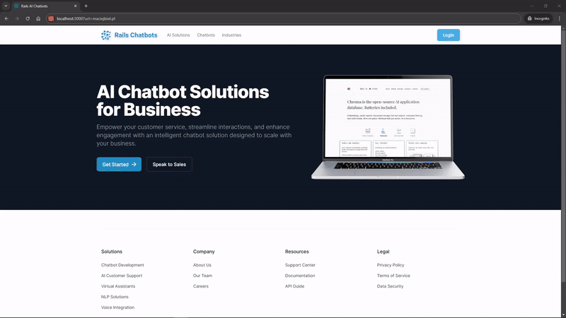
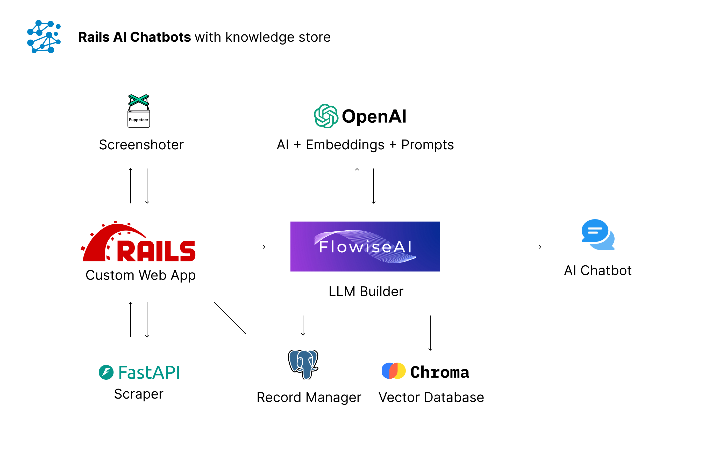
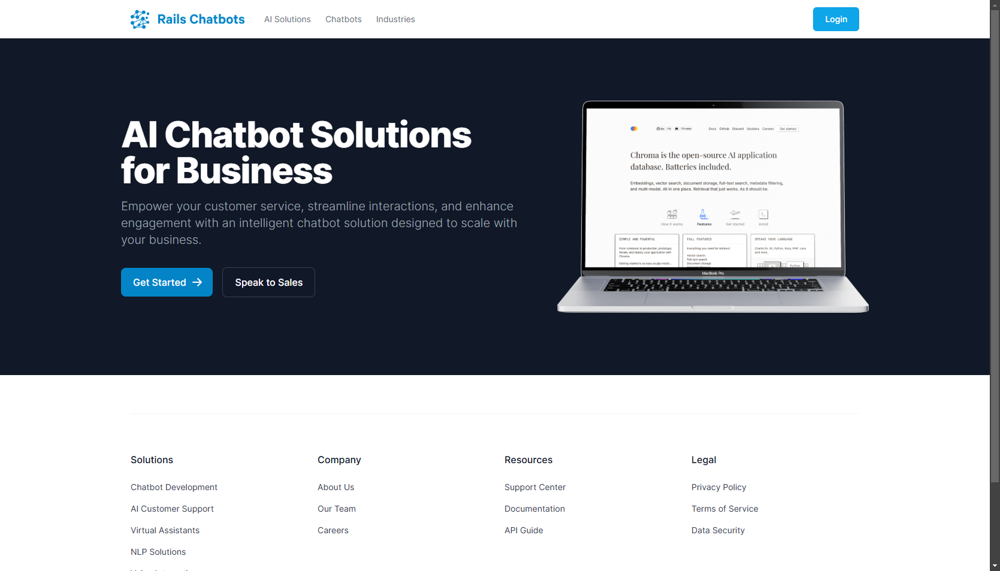
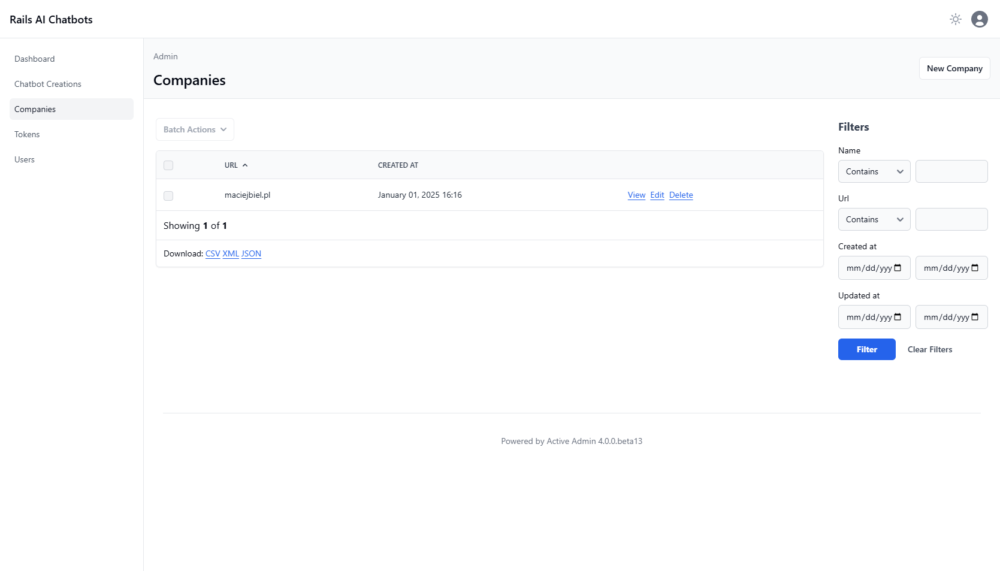
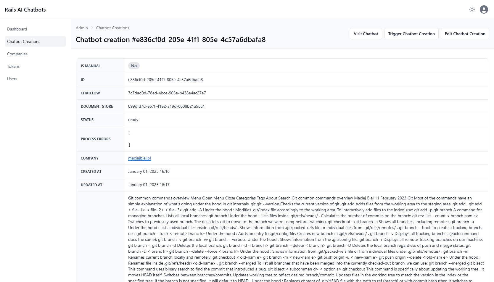
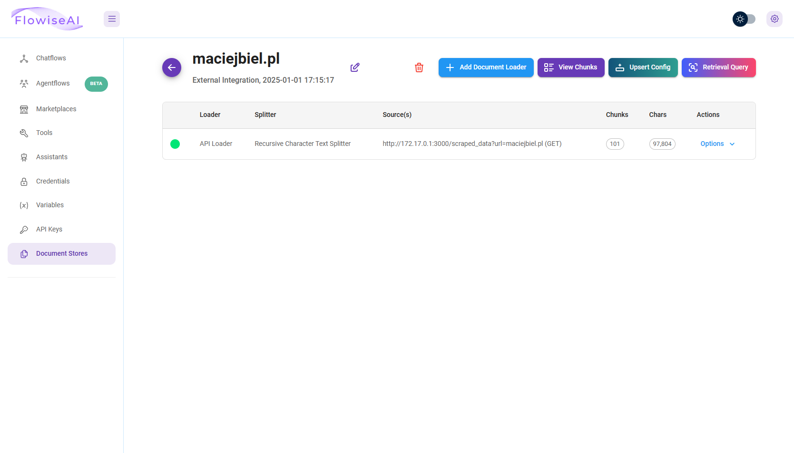
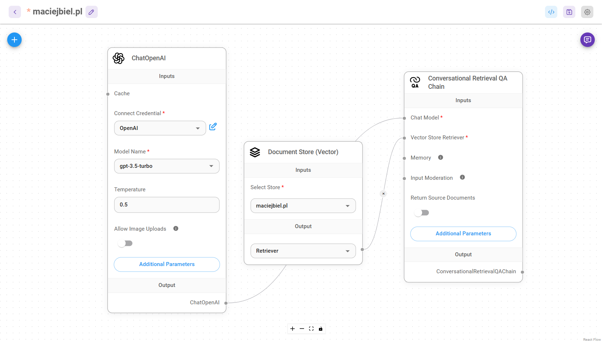

# Rails AI Chatbots

Create a **RAG AI chatbot** from scraped data of any website, leveraging the simplicity of **OpenAI**, **low-code** tools, background processing and **Ruby on Rails**.

  
  
  
  
  
  

  
  
  
  
  
  

## Technologies Used
- **App**: `Ruby 3.3.5`, `Ruby on Rails 7.2`, `Hotwire`, `ActiveJob`, `ActiveAdmin 4`, `Docker`, `Faraday`.
- **Low-Code LLM**: `FlowiseAI`, `OpenAI`.
- **Vector Database**: `ChromaDB`.
- **Relational Database**: `PostgreSQL`.
- **Scraper**: `FastAPI`, `Python`.
- **Screenshoter**: `Puppeteer`, `Node.js`.

## System Diagram

## Project Overview

This project enables you to create a **RAG (Retrieval-Augmented Generation)** AI chatbot from any website's data in just seconds!

### 🎯 Key Features:

- **Instant Website Integration:**  
  Simply provide the website's URL via a parameter or through the admin panel.

- **Automated Pipeline:**  
  Once the URL is provided, the app triggers the following processes:
  - **Scrape Website Data**: Extracts relevant content from the provided website.
  - **Create Document Store**: Stores the data in FlowiseAI for seamless retrieval.
  - **Generate Embeddings**: Converts the scraped content into embeddings and uploads them to ChromaDB.
  - **Set Up Chatflow**: Automatically creates a chatflow in FlowiseAI for conversational interactions.
  - **Website Screenshot**: Captures a high-quality screenshot of the website.

- **Embedded Chatbot Interface:**
  The chatbot is displayed beautifully with the scraped website as the background. Users can ask questions about the website's content and get accurate AI-powered answers in real-time.

### 💡 How It Works:
1. Input a URL.
2. Watch the magic happen as the app processes the website in the background (builds the chatbot, and integrates it seamlessly).
3. Start asking questions and receiving contextually accurate answers based on the website's data.

### 🤖 Why Use This?
- Simplifies chatbot creation with minimal effort.
- Provides a visually appealing and user-friendly experience.
- Leverages the power of AI to answer questions directly from website data.

## Screenshots:

**Home Page:**

The home page of the app where you can input the URL of the website you want to create a chatbot for or login to the admin panel.

**Admin Panel:**

Manage the companies added to the system, from which the chatbots are created.

You can also view the chatbot creation history and manage the chatbot creation process, with the ability to view the chatbot's details (like the chatflow ID, document store ID, errors, scraped data, screenshots, etc.).

**FlowiseAI Integration:**

The app leverages the power of FlowiseAI to create a seamless chatbot experience. The chatbot is trained on the scraped website data and can answer questions accurately using upserted vector store with embeddings.

The chatflow is very simple and only connects the chatbot to the document store.

## Installation and Setup

Clone the whole monorepository before starting the setup and navigate to the root directory of the project.

### 1️⃣ FlowiseAI, ChromaDB, PostgreSQL

1. Go to `llm` directory.
2. Run `docker compose up -d --remove-orphans` to start the **FlowiseAI**, **ChromaDB** and **PostgreSQL**.
3. Enter the **FlowiseAI** by opening the URL `http://localhost:3020/`
4. Login with `admin:admin` credentials.
5. Go to `Credentials` and create a new credential with the following details:
   - Name: `OpenAI`
     - API Key: `<your-openai-api-key>`
   - Name: `Postgres`
     - user: `postgres`
     - password: `postgres`

### 2️⃣ Scraper

1. Go to the `scraper` directory.
2. Create a new virtual environment with `python -m venv env`.
3. Activate the virtual environment with `source env/bin/activate`.
4. Install dependencies with `pip install -r requirements.txt`.
5. Run the scraper with `fastapi dev main.py --port 3002`.

### 3️⃣ Screenshoter

1. Go to the `screenshoter` directory.
2. Install dependencies with `pnpm install`.
3. Run the screenshoter with `pnpm start`.

### 4️⃣ Rails App

1. Go to the `app` directory.
2. Install gems with `bundle install`.
3. Setup the database with `./bin/setup`.
4. Run the Rails app with `./bin/dev` and open the URL `http://localhost:3000/`.